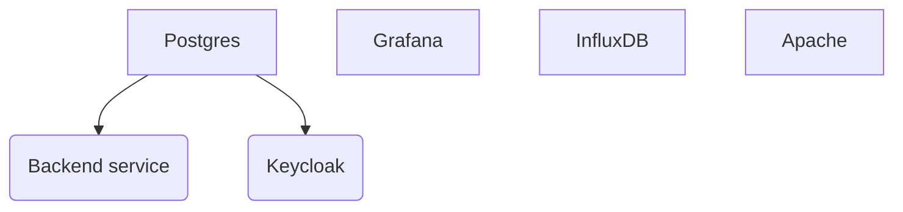

# How to run 

Run with 

```
docker-compose --env-file .env.dev up
```


## Docker compose file
Here is the docker dependencies of `docker-compose.yaml`


## Set Grafana keycloak authentification 

Keycloak : 
- Click master -> Create Realm named `Test`
- Switch to the `Test` realm
- Click on Clients
- Click on Create client
- Set Client Id to `grafana`
- Next
- Switch on Client authentification
- Next
- Next
- Switch to the credentials tab
- Copy the secret

Grafana
- Adjust the `auth.generic_oauth` of the  configuration file `./containers/grafana/config.ini`

```ini
[auth.generic_oauth]
enabled = true
name = Keycloak-OAuth
allow_sign_up = true
client_id = grafana
client_secret = <You copied secret>
scopes = openid email profile offline_access roles
email_attribute_path = email
login_attribute_path = username
name_attribute_path = full_name
auth_url = http://localhost:8081/realms/Test/protocol/openid-connect/auth
# Address inside docker network
token_url = http://keycloak:8080/realms/Test/protocol/openid-connect/token
api_url = http://keycloak:8080/realms/Test/protocol/openid-connect/userinfo
role_attribute_path = contains(roles[*], 'admin') && 'Admin' || contains(roles[*], 'editor') && 'Editor' || 'Viewer'
```

There you go !

## Download spreadsheet

In order to download a spreadsheet from google we use the following endpoint : 

```
https://docs.google.com/spreadsheets/d/{self.id}/gviz/tq?tqx=out:{self.what}&gid={self.gid}
```

Helper script is inside `spreadsheet/`, you need to fill the `config.example.toml` and rename it to `config.toml`.


Each section is read and downloaded

Config of toml file : 

| Attribute   | Type   | Comment                            |
|-------------|--------|------------------------------------|
| id          | str    | Id of the spreadsheet              |
| gid         | number | Number of the sheet                |
| export_type | str    | Type of export you want (csv, pdf) |
| output_file | str    | Where to save the file             |

## Grafana API

Grafana API is high level API  and it wraps some of the `grafanalib` API. 

The following features are implemented :

- [x] Add an alert
- [x] Add a dashboard
- [x] Add a contact point
- [x] Add a notification policy

#### Add a contact point 

```python
    from addons.contact import ContactPointEmail, ContactPointEmailSettings
    from notification_manager import NotificationManager

    contact_point = ContactPointEmail(
        "New contact point", ContactPointEmailSettings(addresses=["a@c.d"])
    )

    GRAFANA_API_URL = "http://localhost:3000/api"
    GRAFANA_AUTH = requests.auth.HTTPBasicAuth("admin", "admin")

    session = requests.Session()
    session.auth = GRAFANA_AUTH
    session.headers.update({"x-disable-provenance": "true"})

    notification_manager = NotificationManager(GRAFANA_API_URL, session)
    notification_manager.add_contact_point(contact_point)
    notification_manager.push()
```

#### Add a notification policy

```python
    from addons.notification_policies import Notification, RegexMatcher, GrafanaMatchType
    from notification_manager import NotificationManager

    notification_policy = Notification(
        "New contact point",
        object_matchers=[
            RegexMatcher("TEAM", GrafanaMatchType.EQUAL.value, "dev")
        ],
    )

    GRAFANA_API_URL = "http://localhost:3000/api"
    GRAFANA_AUTH = requests.auth.HTTPBasicAuth("admin", "admin")

    session = requests.Session()
    session.auth = GRAFANA_AUTH
    session.headers.update({"x-disable-provenance": "true"})

    notification_manager = NotificationManager(GRAFANA_API_URL, session)
    notification_manager.add_notification_policy(notification_policy)
    notification_manager.push()
```

### Add an alert

Adding an alert is quite tricky, It relies on the Alert models from the grafanalib package. 
Please see 
- https://github.com/weaveworks/grafanalib
- https://grafanalib.readthedocs.io/en/stable/

It is much more easier to start from this example and build your own rule.

```python
    from alert_manager import AlertManager
    from addons.alert import AlertRulev9Fixed
    from grafanalib.core import (
        AlertGroup,
        Target,
        AlertCondition,
        AlertExpression,
        GreaterThan,
        OP_AND,
        RTYPE_LAST,
        EXP_TYPE_CLASSIC,
    )
    alertgroup = AlertGroup(
        name="Production Alerts",
        evaluateInterval="10m",
        # Each AlertRule forms a separate alert.
        rules=[
            # Alert rule using classic condition > 3
            AlertRulev9Fixed(
                # Each rule must have a unique title
                title="Alert for something 1",
                uid='alert1',
                # Several triggers can be used per alert
                condition='B',
                triggers=[
                    # A target refId must be assigned, and exist only once per AlertRule.
                    Target(
                        expr="from(bucket: \"sensors\")\n  |> range(start: v.timeRangeStart, stop: v.timeRangeStop)\n  |> filter(fn: (r) => r[\"_measurement\"] == \"remote_cpu\")\n  |> filter(fn: (r) => r[\"_field\"] == \"usage_system\")\n  |> filter(fn: (r) => r[\"cpu\"] == \"cpu-total\")\n  |> aggregateWindow(every: v.windowPeriod, fn: mean, createEmpty: false)\n  |> yield(name: \"mean\")",
                        # Set datasource to name of your datasource
                        # If it does not work set the datasourceUID
                        datasource="ChyluIf4k",
                        refId="A",
                    ),
                    AlertExpression(
                        refId="B",
                        expressionType=EXP_TYPE_CLASSIC,
                        expression='A',
                        conditions=[
                            AlertCondition(
                                evaluator=GreaterThan(3),
                                operator=OP_AND,
                                reducerType=RTYPE_LAST
                            )
                        ]
                    )
                ],
                annotations={
                    "summary": "The database is down",
                    "runbook_url": "runbook-for-this-scenario.com/foo",
                },
                labels={
                    "environment": "prod",
                    "slack": "prod-alerts",
                },
                evaluateFor="3m",
            ),
        ]
    )
    
    GRAFANA_API_URL = "http://localhost:3000/api"
    GRAFANA_AUTH = requests.auth.HTTPBasicAuth("admin", "admin")

    session = requests.Session()
    session.auth = GRAFANA_AUTH
    session.headers.update({"x-disable-provenance": "true"})

    alert_rule_manager = AlertManager(GRAFANA_API_URL, session)
    alert_rule_manager.add_alert(alertgroup, folder="My custom folder")
    alert_rule_manager.push()

```

### Add a Dashboard

```python 
    from dashboard_manager import DashboardManager
    from grafanalib.core import (
        Dashboard, TimeSeries, GaugePanel,
        Target, GridPos,
        OPS_FORMAT
    )

    dashboard = Dashboard(
        title="Python generated example dashboard",
        description="Example dashboard using the Random Walk and default Prometheus datasource",
        tags=[
            'example'
        ],
        timezone="browser",
        panels=[
            TimeSeries(
                title="Random Walk",
                dataSource='default',
                targets=[
                    Target(
                        datasource='grafana',
                        expr='example',
                    ),
                ],
                gridPos=GridPos(h=8, w=16, x=0, y=0),
            ),
            GaugePanel(
                title="Random Walk",
                dataSource='default',
                targets=[
                    Target(
                        datasource='grafana',
                        expr='example',
                    ),
                ],
                gridPos=GridPos(h=4, w=4, x=17, y=0),
            ),
            TimeSeries(
                title="Prometheus http requests",
                dataSource='prometheus',
                targets=[
                    Target(
                        expr='rate(prometheus_http_requests_total[5m])',
                        legendFormat="{{ handler }}",
                        refId='A',
                    ),
                ],
                unit=OPS_FORMAT,
                gridPos=GridPos(h=8, w=16, x=0, y=10),
            ),
        ],
    ).auto_panel_ids()

    GRAFANA_API_URL = "http://localhost:3000/api"
    GRAFANA_AUTH = requests.auth.HTTPBasicAuth("admin", "admin")


    session = requests.Session()
    session.auth = GRAFANA_AUTH
    session.headers.update({"x-disable-provenance": "true"})
    dashboard_manager = DashboardManager(GRAFANA_API_URL, session)

    dashboard_manager.add_dashboard(dashboard)
    dashboard_manager.push()
```

### Build a flux query 

```python
query = (
    FluxQueryBuilder("My bucket")
    .range(start="5m", stop="2m")
    .filter(on="_measurement", what="my_var")
    .build()
)
print(query)
```
will print 

```
from(bucket: "My bucket")
    |> range(start: 5m , stop: 2m)
    |> filter(fn: (r) => r["_measurement"] == "my_var")
```


## To do 

### Django

- [ ] Integrate authentification  `keycloak` with `django allauth`
- [ ] 
### Grafana API

- [ ] Add a datasource

### Grafana and keycloak
- [x] Add a keycloak user.

 
