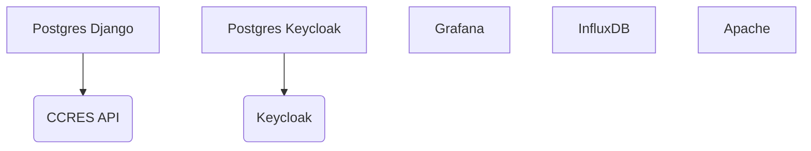

# How to run 

Run with 

```
docker compose --env-file .env.local -f local.yml up --build
```

## Docker compose file
Here is the docker dependencies of `docker-compose.yaml`



## Set Grafana keycloak authentification 

Keycloak : 
- Click master -> Create Realm named `Test`
- Switch to the `Test` realm
- Click on Clients
- Click on Create client
- Set Client Id to `grafana`
- Next
- Switch on Client authentification
- Next
- Next
- Switch to the credentials tab
- Copy the secret

Grafana
- Adjust the `auth.generic_oauth` of the  configuration file `./containers/grafana/config.ini`

```ini
[auth.generic_oauth]
enabled = true
name = Keycloak-OAuth
allow_sign_up = true
client_id = grafana
client_secret = <You copied secret>
scopes = openid email profile offline_access roles
email_attribute_path = email
login_attribute_path = username
name_attribute_path = full_name
auth_url = http://localhost:8081/realms/Test/protocol/openid-connect/auth
# Address inside docker network
token_url = http://keycloak:8080/realms/Test/protocol/openid-connect/token
api_url = http://keycloak:8080/realms/Test/protocol/openid-connect/userinfo
role_attribute_path = contains(roles[*], 'admin') && 'Admin' || contains(roles[*], 'editor') && 'Editor' || 'Viewer'
```
# Set up Django-keycloak authentification 

See https://gitlab.in2p3.fr/gaia-data/wp2-architecture/iam-sso/keycloak-django


There you go !

## Features

- ✅ Adding a contact point in the Django Admin interface creates a contact point in Grafana through signals.
- ✅ Adding a parameter, an instrument, an instrument model or a station in the Django admin interface creates or updates all the dashboard in Grafana through signals.
## To do 

### Django

- [ ] Integrate authentification  `keycloak` with `django allauth`
- [ ] 
### Grafana API

- [ ] Add a datasource

### Grafana and keycloak
- [x] Add a keycloak user.

 
